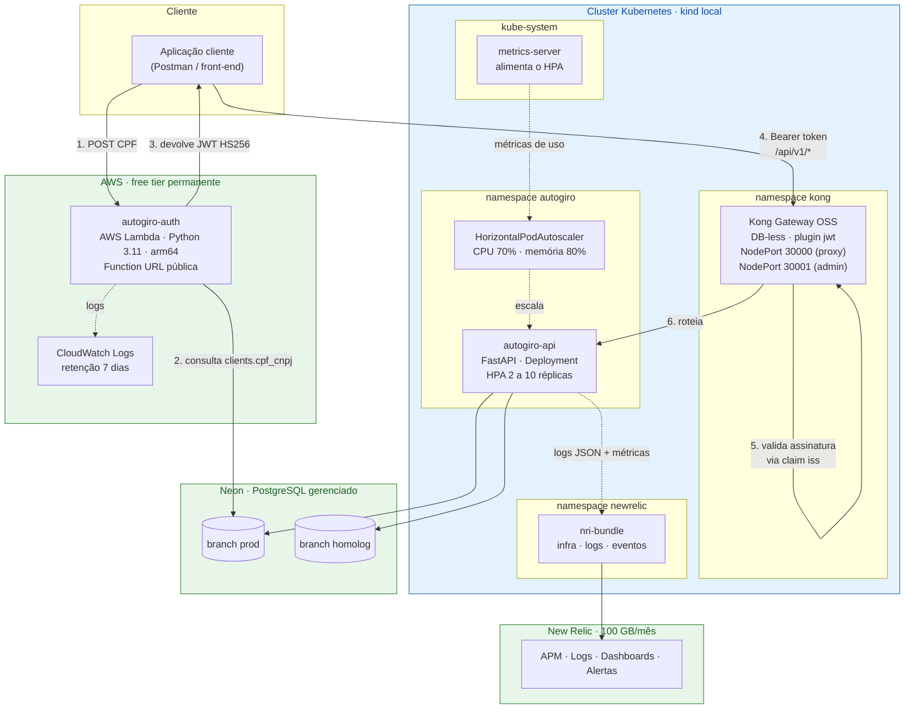
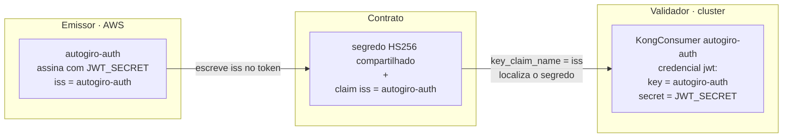

# Diagrama de Componentes — AutoGiro

Visão de nuvem, APIs, banco e monitoramento, conforme exigido na documentação
arquitetural da Fase 3.

## Visão geral

## O contrato entre emissor e validador

O ponto arquitetural central: **a Lambda emite o token e o Kong o valida, sem que nenhum
conheça o outro.** O contrato são apenas o segredo HS256 e a claim `iss`.

Ver [ADR-004](../adrs/ADR-004-emissor-desacoplado-do-validador.md) para a decisão completa.

## Componentes e responsabilidades

| Componente | Repositório | Responsabilidade | Custo |
|---|---|---|---|
| `autogiro-auth` | autogiro-auth | Valida CPF, consulta o cliente, emite JWT | grátis permanente |
| Kong Gateway OSS | autogiro-infra-k8s | Roteia `/api/v1/*` e valida a assinatura do JWT | open source |
| `autogiro-api` | autogiro-app | Regras de negócio da oficina (OS, veículos, peças) | local |
| HPA + metrics-server | infra-k8s / app | Escalabilidade horizontal por CPU e memória | local |
| Neon PostgreSQL | autogiro-infra-db | Persistência, com branches por ambiente | grátis permanente |
| New Relic | autogiro-infra-k8s | APM, logs, dashboards e alertas | grátis permanente |

## Exposição de rotas

O Kong recebe dois Ingress com políticas distintas
([`k8s/ingress.yaml`](../../../k8s/ingress.yaml)):

| Ingress | Caminhos | Plugin JWT |
|---|---|---|
| `autogiro-api` | `/api/v1` | **sim** — `konghq.com/plugins: autogiro-jwt` |
| `autogiro-api-public` | `/health`, `/docs`, `/openapi.json` | não |

Deixar a documentação e os healthchecks fora da proteção é deliberado: probes do Kubernetes
não carregam token, e o Swagger precisa ser alcançável para a avaliação.

## Onde cada requisito do enunciado é atendido

| Requisito | Componente |
|---|---|
| API Gateway | Kong Gateway OSS no cluster |
| Function Serverless para autenticação | AWS Lambda `autogiro-auth` |
| Banco de Dados Gerenciado | Neon PostgreSQL |
| Cluster Kubernetes com escalabilidade | kind + HPA (2 a 10) + metrics-server |
| Terraform para provisionamento | 3 repositórios de infraestrutura |
| Observabilidade | New Relic + Prometheus/Grafana local |
