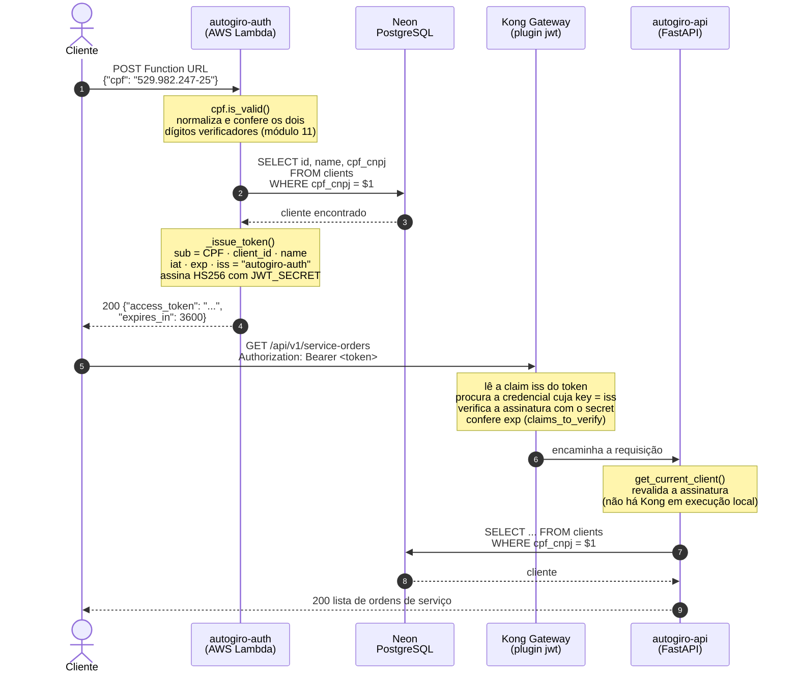
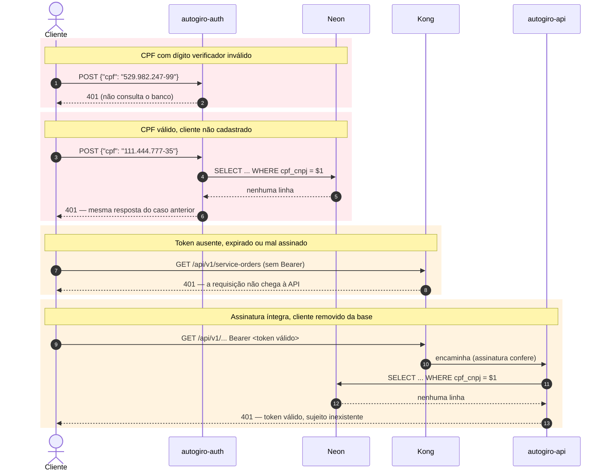
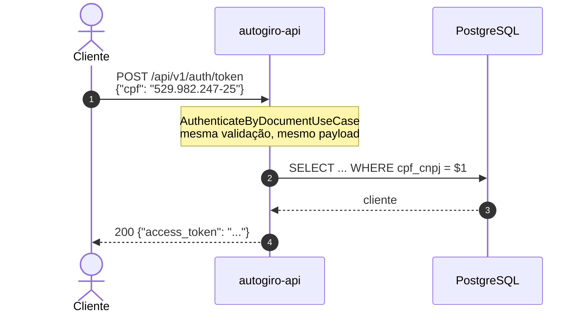

# Diagrama de Sequência — Autenticação por CPF

Fluxo exigido pelo enunciado: validar o CPF, consultar o cliente na base, devolver um JWT
e usá-lo para consumir uma rota protegida.

## Caminho de sucesso

## Caminhos de erro

### Por que CPF inválido e CPF não cadastrado respondem igual

Se o CPF malformado retornasse `400` e o não cadastrado `404`, qualquer pessoa poderia
descobrir **quais CPFs são clientes da oficina** testando documentos válidos e observando a
diferença. Como o CPF é um dado pessoal, os dois casos devolvem `401` sem distinção.

O mesmo raciocínio se aplica ao quarto caso: uma assinatura válida cujo sujeito não existe
mais recebe `401`, e não `404` — o problema é de autenticação, não de recurso ausente.

## Execução sem a AWS

A API expõe `POST /api/v1/auth/token` com o mesmo contrato da Lambda, para rodar e demonstrar
o sistema localmente (Docker Compose, testes de integração). O token produzido é
**intercambiável**: mesmo segredo HS256, mesma claim `iss`.

Isso foi verificado na prática: um token gerado pelo código da Lambda foi aceito pela API,
que resolveu o cliente pelo CPF e liberou a rota protegida.

## Referências de código

| Etapa | Arquivo |
|---|---|
| Validação do CPF (Lambda) | [`autogiro-auth/src/cpf.py`](../../../../autogiro-auth/src/cpf.py) |
| Emissão do token | [`autogiro-auth/src/handler.py`](../../../../autogiro-auth/src/handler.py) |
| Consumer e plugin do Kong | [`autogiro-infra-k8s/terraform/kong-jwt.tf`](../../../../autogiro-infra-k8s/terraform/kong-jwt.tf) |
| Resolução do cliente na API | [`app/interfaces/http/dependencies.py`](../../../app/interfaces/http/dependencies.py) |
| Validação do CPF (domínio da API) | [`app/domain/value_objects/cpf.py`](../../../app/domain/value_objects/cpf.py) |

Decisão completa em [ADR-004](../adrs/ADR-004-emissor-desacoplado-do-validador.md) e
[RFC-003](../rfcs/RFC-003-estrategia-de-autenticacao.md).
