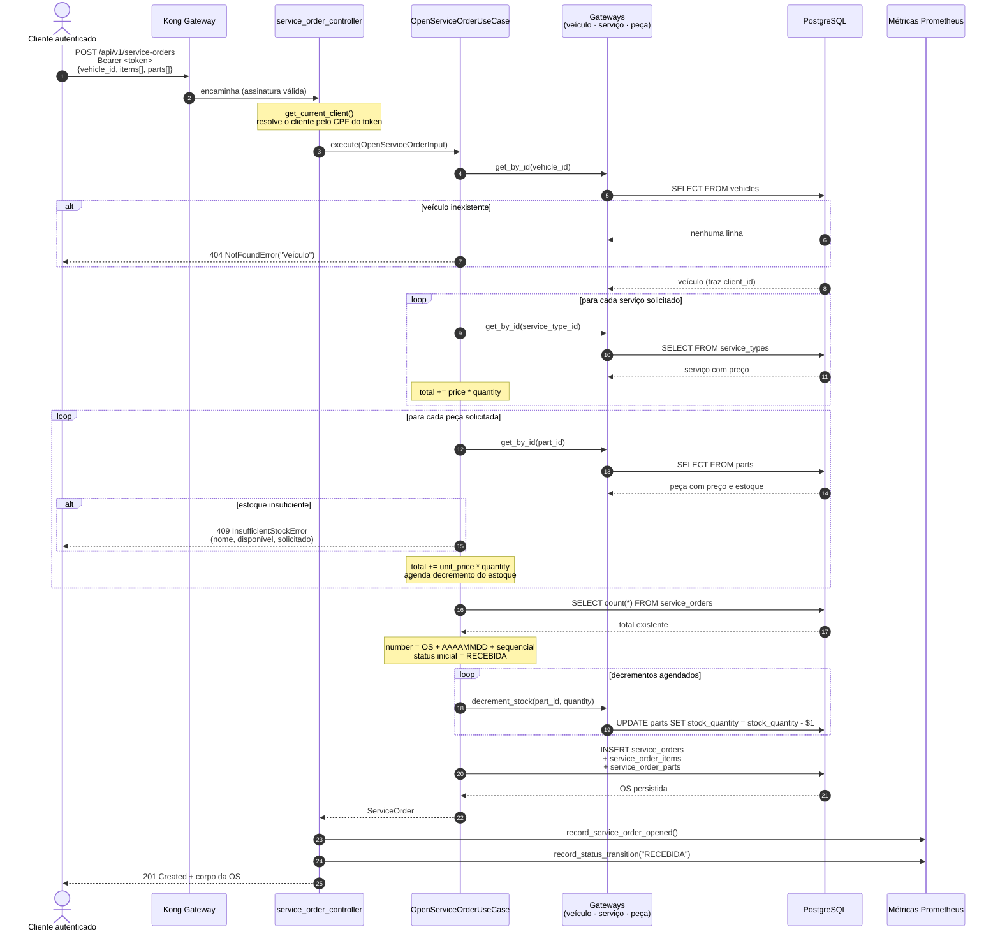
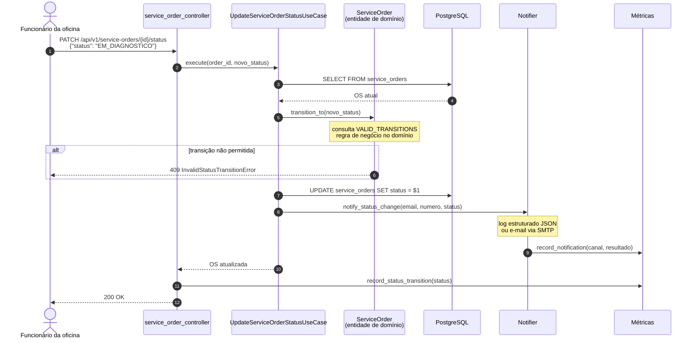
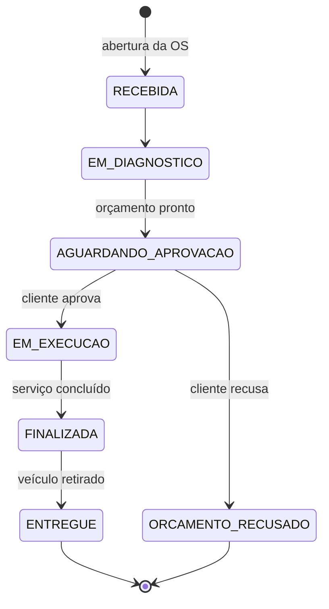

# Diagrama de Sequência — Abertura de Ordem de Serviço

Segundo fluxo exigido pela documentação arquitetural. Cobre a abertura da OS e a evolução do
seu status até a entrega.

## Abertura da OS

**Ordem das operações:** o estoque só é decrementado depois de todas as validações passarem.
Assim uma OS rejeitada por veículo inexistente ou peça em falta não deixa efeito colateral no
inventário.

## Evolução do status

A notificação **nunca derruba o fluxo**: falha de SMTP é registrada e contabilizada como
`autogiro_notifications_total{result="failed"}`, mas não propaga exceção — a OS já foi
atualizada com sucesso quando a notificação dispara.

## Máquina de estados

As transições são validadas em dois níveis:

| Nível | Mecanismo |
|---|---|
| Domínio | `VALID_TRANSITIONS` em `service_order_status.py` — rejeita salto inválido com `409` |
| Banco | `CREATE TYPE service_order_status AS ENUM (...)` — o PostgreSQL rejeita valor fora da lista |

Os status terminais (`FINALIZADA`, `ENTREGUE`, `ORCAMENTO_RECUSADO`) não têm saída, e são
usados para ocultar OS encerradas da listagem de trabalho ativo.

Os três estados que o enunciado cita para o dashboard de tempo médio correspondem a
`EM_DIAGNOSTICO` (Diagnóstico), `EM_EXECUCAO` (Execução) e `FINALIZADA` (Finalização).

## Referências de código

| Etapa | Arquivo |
|---|---|
| Abertura da OS | [`use_cases/open_service_order.py`](../../../app/application/use_cases/open_service_order.py) |
| Mudança de status | [`use_cases/update_service_order_status.py`](../../../app/application/use_cases/update_service_order_status.py) |
| Máquina de estados | [`domain/value_objects/service_order_status.py`](../../../app/domain/value_objects/service_order_status.py) |
| Entidade | [`domain/entities/service_order.py`](../../../app/domain/entities/service_order.py) |
| Notificações | [`infrastructure/notifications/notifier.py`](../../../app/infrastructure/notifications/notifier.py) |
| Métricas | [`infrastructure/observability/metrics.py`](../../../app/infrastructure/observability/metrics.py) |
